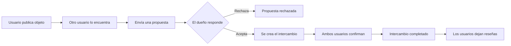
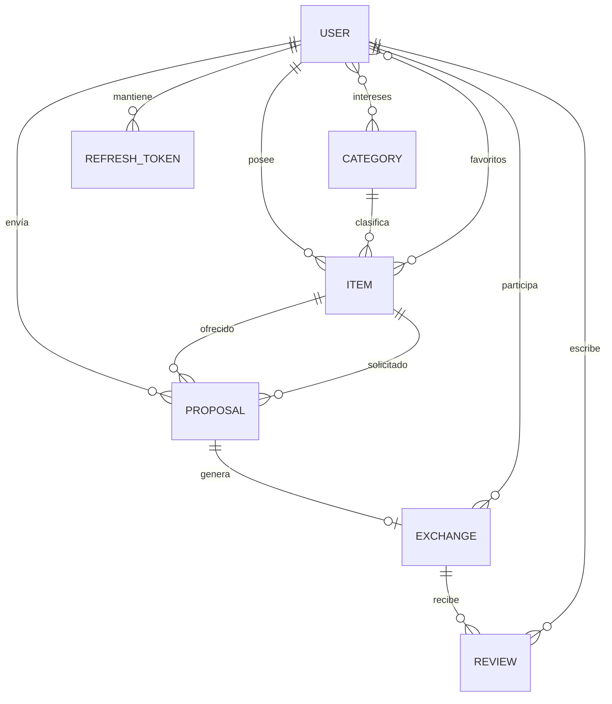
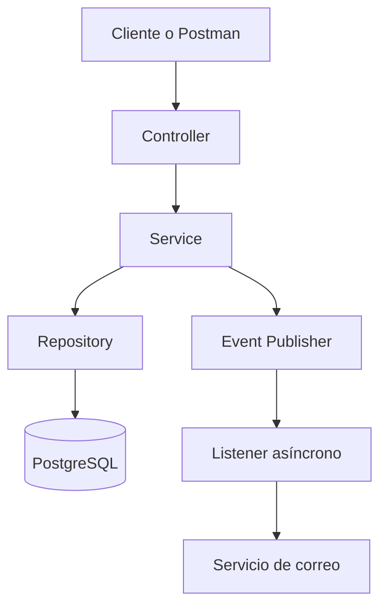
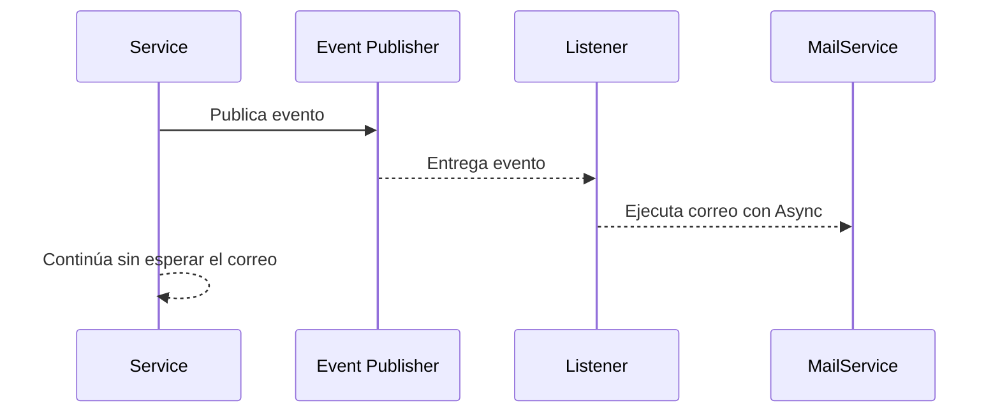
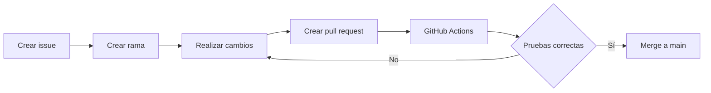
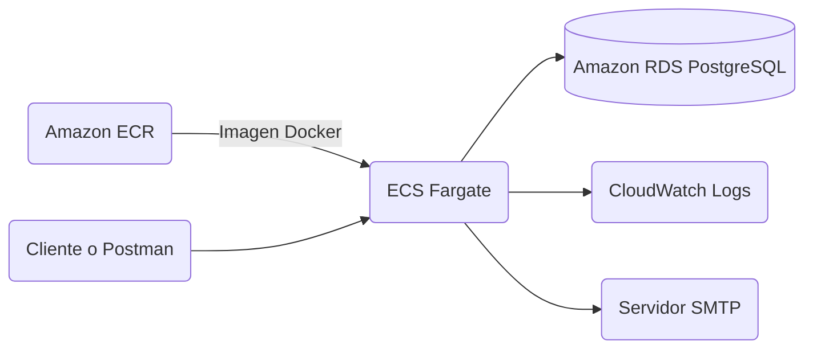

# SwapIt Backend

## CS2031 Desarrollo Basado en Plataforma

### Integrantes

- Walter Sebastian Aquino Pachas
- Adrian Valentino Gamboa Rodriguez
- Corbin Kaufman Monzon
- Nicolas Lara Alvarez
- Rodolfo Antonio Lara Alvarez

## Índice

1. [Introducción](#1-introducción)
2. [Problema identificado](#2-problema-identificado)
3. [Solución propuesta](#3-solución-propuesta)
4. [Funcionalidades implementadas](#4-funcionalidades-implementadas)
5. [Tecnologías utilizadas](#5-tecnologías-utilizadas)
6. [Modelo de entidades](#6-modelo-de-entidades)
7. [Arquitectura](#7-arquitectura)
8. [Manejo de errores](#8-manejo-de-errores)
9. [Seguridad](#9-seguridad)
10. [Eventos y asincronía](#10-eventos-y-asincronía)
11. [API REST](#11-api-rest)
12. [Pruebas](#12-pruebas)
13. [GitHub y gestión](#13-github-y-gestión)
14. [Despliegue en AWS](#14-despliegue-en-aws)
15. [Ejecución local](#15-ejecución-local)
16. [Conclusión](#16-conclusión)
17. [Referencias](#17-referencias)

## 1. Introducción

Muchas personas conservan objetos que ya no utilizan, aunque todavía están en buenas condiciones. Otras podrían necesitarlos y ofrecer algo a cambio.

Estos intercambios suelen coordinarse mediante redes sociales o grupos de mensajes. La información queda desordenada y dificulta encontrar lo que se busca.

SwapIt busca organizar este proceso mediante una plataforma donde los usuarios publican sus objetos, buscan otros productos y envían propuestas de intercambio.

### Objetivos

- Permitir el registro e inicio de sesión de usuarios.
- Publicar objetos disponibles para intercambio.
- Buscar objetos usando diferentes filtros.
- Enviar, aceptar, rechazar y cancelar propuestas.
- Confirmar intercambios entre dos usuarios.
- Guardar objetos favoritos y categorías de interés.
- Calificar a otro usuario después de un intercambio.

## 2. Problema identificado

Las plataformas de venta se centran en operaciones con dinero. Un intercambio directo requiere conocer qué ofrece cada usuario, qué busca y si los objetos continúan disponibles.

Usar publicaciones dispersas también puede ocasionar propuestas duplicadas, confusión sobre el estado de los objetos y poca seguridad sobre la identidad de las personas.

Resolverlo promueve la reutilización, reduce compras innecesarias y permite intercambios con estados y reglas más claras.

## 3. Solución propuesta

SwapIt es una API REST para administrar intercambios de objetos entre usuarios.

Cada objeto funciona como una publicación, por lo que no se necesita una entidad `Publication` separada. Contiene descripción, categoría, condición, ubicación, estado y lo que el propietario desea recibir.

El flujo principal funciona de esta forma:



## 4. Funcionalidades implementadas

| Módulo | Funciones principales |
|---|---|
| Autenticación | Registro, login, refresh token y cierre de sesión |
| Objetos | Publicación, consulta, eliminación, filtros y paginación |
| Preferencias | Objetos favoritos, categorías de interés y recomendaciones |
| Propuestas | Crear, aceptar, rechazar y cancelar propuestas |
| Intercambios | Confirmar, completar o cancelar un intercambio |
| Reseñas | Calificar al otro participante después del intercambio |
| Notificaciones | Correos por registro, propuesta aceptada e intercambio completado |

El sistema valida la disponibilidad de los objetos antes de aceptar una propuesta. Durante el intercambio quedan reservados y, si se cancela, vuelven a estar disponibles.

Solo los participantes pueden crear una reseña después de completar el intercambio.

## 5. Tecnologías utilizadas

| Tecnología | Uso en el proyecto |
|---|---|
| Java 21 | Lenguaje principal |
| Spring Boot 4 | Base de la aplicación |
| Spring Web MVC | Endpoints REST |
| Spring Data JPA | Acceso a la base de datos |
| Spring Security | Autenticación y permisos |
| PostgreSQL | Base de datos principal |
| H2 | Base de datos para pruebas |
| JWT | Tokens de acceso y renovación |
| JavaMailSender | Envío de correos |
| Maven | Dependencias y compilación |
| Docker | Empaquetado y ejecución |
| GitHub Actions | Ejecución automática de pruebas |
| Postman | Documentación y prueba de endpoints |

No se utilizaron API externas porque no eran necesarias para completar el MVP.

## 6. Modelo de entidades

El proyecto utiliza siete entidades principales.

| Entidad | Responsabilidad |
|---|---|
| `User` | Usuario registrado, contraseña cifrada y rol |
| `Category` | Clasificación de los objetos |
| `Item` | Objeto publicado para intercambio |
| `Proposal` | Oferta de un objeto por otro |
| `Exchange` | Confirmación y estado del intercambio |
| `Review` | Calificación entre los participantes |
| `RefreshToken` | Renovación y cierre de sesiones |



Las relaciones se implementaron con anotaciones como `@ManyToOne`, `@OneToMany`, `@ManyToMany` y `@OneToOne`. Se utiliza carga `LAZY` donde no es necesario obtener los datos relacionados inmediatamente.

También se agregaron validaciones como `@NotNull`, `@NotBlank`, `@Size`, `@Email`, `@Min` y `@Max`.

## 7. Arquitectura

La aplicación separa la recepción de solicitudes, las reglas del negocio y el acceso a los datos.



Los controllers reciben los datos y llaman a los services. Las validaciones del intercambio están en los services y los repositories se encargan de consultar PostgreSQL.

Los DTOs separan los datos recibidos de las respuestas. Esto evita devolver las entidades completas o mostrar información sensible como las contraseñas.

## 8. Manejo de errores

El proyecto tiene excepciones para recursos inexistentes, conflictos, permisos insuficientes, credenciales incorrectas y tokens inválidos.

`GlobalExceptionHandler` utiliza `@RestControllerAdvice` para producir respuestas con un mismo formato:

```json
{
  "timestamp": "2026-09-25T20:00:00",
  "status": 404,
  "error": "Not Found",
  "message": "El recurso no fue encontrado",
  "path": "/api/v1/items/100"
}
```

| Código | Situación |
|---:|---|
| 400 | Solicitud o validación incorrecta |
| 401 | Usuario sin autenticación válida |
| 403 | Usuario sin permiso para la operación |
| 404 | Recurso no encontrado |
| 409 | Conflicto con el estado de los datos |
| 500 | Error inesperado del servidor |

## 9. Seguridad

Las contraseñas se cifran con BCrypt y nunca forman parte de las respuestas. La autenticación utiliza JWT y un filtro que revisa el encabezado `Authorization`.

Existen los roles `USER` y `ADMIN`. Los administradores pueden gestionar categorías y consultar usuarios. Un usuario común solo puede modificar sus objetos y participar en propuestas o intercambios relacionados con su cuenta.

| Medida | Aplicación |
|---|---|
| BCrypt | Protege las contraseñas almacenadas |
| JWT | Autentica las solicitudes sin sesión tradicional |
| Refresh token | Permite renovar y revocar sesiones |
| Variables de entorno | Protegen claves y credenciales |
| Spring Data JPA | Usa parámetros y reduce el riesgo de inyección SQL |
| CORS | Limita los orígenes que pueden consumir la API |
| Validación | Rechaza entradas incompletas o incorrectas |

CSRF se encuentra desactivado debido a que la API es stateless y utiliza tokens en el encabezado. La autorización también se valida dentro de los servicios para comprobar la propiedad de objetos y la participación en intercambios.

## 10. Eventos y asincronía

Se implementaron eventos en tres operaciones importantes:

1. Registro de un usuario.
2. Aceptación de una propuesta.
3. Finalización de un intercambio.



`NotificationEventListener` procesa estos eventos usando `@Async`. Se configuró un `ThreadPoolTaskExecutor` para que el usuario no tenga que esperar mientras se conecta con el servidor de correo.

Si el correo falla, se registra el error y la operación principal no se pierde.

## 11. API REST

Todos los endpoints utilizan el prefijo `/api/v1`.

| Método | Ruta | Descripción |
|---|---|---|
| POST | `/api/v1/auth/register` | Registrar usuario |
| POST | `/api/v1/auth/login` | Iniciar sesión |
| POST | `/api/v1/auth/refresh` | Renovar tokens |
| GET | `/api/v1/items` | Buscar objetos |
| POST | `/api/v1/items` | Publicar objeto |
| DELETE | `/api/v1/items/{id}` | Eliminar objeto propio |
| POST | `/api/v1/proposals` | Crear propuesta |
| PATCH | `/api/v1/proposals/{id}/accept` | Aceptar propuesta |
| PATCH | `/api/v1/proposals/{id}/reject` | Rechazar propuesta |
| GET | `/api/v1/exchanges` | Consultar intercambios |
| PATCH | `/api/v1/exchanges/{id}/confirm` | Confirmar intercambio |
| POST | `/api/v1/reviews` | Crear reseña |

La colección `postman_collection.json` se encuentra en la raíz del repositorio. Contiene ejemplos, variables, autorización y solicitudes para probar los recursos principales.

## 12. Pruebas

Se implementaron pruebas de integración para autenticación, permisos, objetos, propuestas, intercambios y reseñas.

| Resultado actual | Cantidad |
|---|---:|
| Pruebas ejecutadas | 39 |
| Fallos | 0 |
| Errores | 0 |
| Omitidas | 0 |

Las pruebas usan H2 y no necesitan una instalación local de PostgreSQL. Se verifican casos correctos y también errores como accesos sin permiso, datos inválidos y operaciones repetidas.

## 13. GitHub y gestión

El equipo utilizó ramas para desarrollar funcionalidades y pull requests para integrar los cambios a `main`. Los issues se organizaron en un orden según sus dependencias.

GitHub Actions ejecuta Maven automáticamente en los pushes y pull requests dirigidos a `main`. Así se comprueba que el proyecto compile y que las pruebas continúen funcionando.



## 14. Despliegue en AWS

El backend se empaquetó mediante un `Dockerfile` de varias etapas. La imagen se almacenó en Amazon ECR y se ejecutó en ECS Fargate. La aplicación utilizó Amazon RDS for PostgreSQL y CloudWatch Logs.



El grupo de seguridad de RDS permite conexiones PostgreSQL desde el grupo utilizado por ECS y no desde toda Internet. Durante la validación, el endpoint público de Fargate respondió correctamente en el puerto configurado. Las credenciales de la base de datos, JWT y correo se proporcionaron como variables de entorno y no se incluyeron en la imagen ni en el repositorio.

## 15. Ejecución local

Se necesita IntelliJ IDEA, Java 21 y Docker.

1. Clonar o descargar el repositorio.
2. Abrir el proyecto en IntelliJ y esperar que cargue Maven.
3. Revisar en **Project Structure** que el SDK sea Java 21.
4. Iniciar Docker Desktop.
5. Levantar PostgreSQL desde la terminal de IntelliJ:

```bash
docker compose up -d
```

6. Crear `.env` usando `.env.example` como referencia.
7. Configurar PostgreSQL y una clave JWT de 32 caracteres.
8. Abrir `ProyectoBackendSwapltApplication` y presionar **Run**.

Cuando aparezca el mensaje `Started ProyectoBackendSwapltApplication`, la API estará disponible en:

```text
http://localhost:8080/api/v1
```

Para las pruebas, se hace clic derecho sobre `src/test/java` y se selecciona **Run Tests**.

El archivo `.env` contiene datos privados y no se debe subir a GitHub.

## 16. Conclusión

SwapIt logró implementar el flujo principal para intercambiar objetos. El backend permite registrar usuarios, publicar objetos, enviar propuestas, confirmar intercambios y dejar reseñas.

Durante el proyecto aprendimos a separar responsabilidades entre controllers, services y repositories. También trabajamos con JWT, validaciones, relaciones JPA, pruebas, Docker y el manejo de errores.

Como trabajo futuro se podría agregar carga de imágenes en S3, recuperación de contraseña, mapas y un sistema de recomendaciones más completo.

## 17. Referencias

- [Spring Boot Documentation](https://docs.spring.io/spring-boot/)
- [Spring Security Documentation](https://docs.spring.io/spring-security/reference/)
- [Spring Data JPA Documentation](https://docs.spring.io/spring-data/jpa/reference/)
- [PostgreSQL Documentation](https://www.postgresql.org/docs/)
- [Docker Documentation](https://docs.docker.com/)
- [Postman Learning Center](https://learning.postman.com/)
- Material del curso CS2031 Desarrollo Basado en Plataforma.
